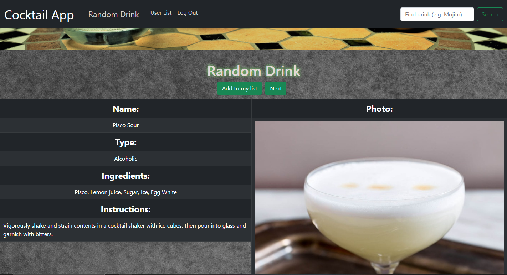
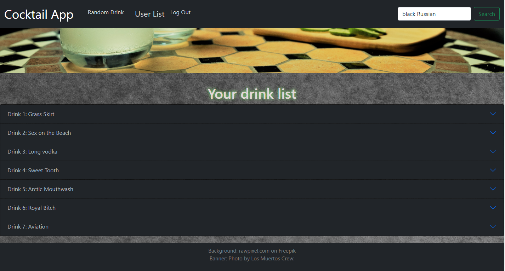
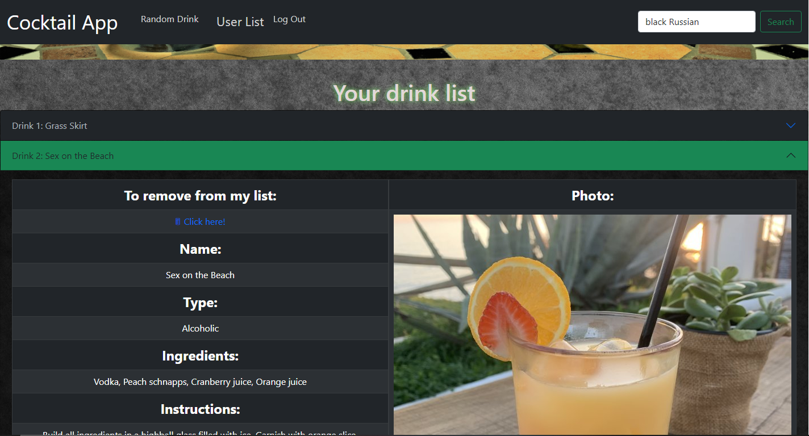

# Cocktail-App: front-end

<br/>
Aplikacja korzysta z zewnętrznego API(thecocktaildb.com), w której możemy pobrać i zapisać na swoim koncie (po wcześniejszej rejestracji i zalogowaniu) losowo wybrany lub konketny (po wpisaniu w wyszukiwarke) drink. Każdy trunek posiada takie informacje jak: Nazwa, składniki, instrukcja przygotowania, info czy jest z alkoholem czy bez oraz zdjęcie pogladowege. Poniżej zamieszczam kilka zdjęć aplikacji.
(Link do back-end'u: https://github.com/Cynio007/cocktail-app-backend).
Live Demo: https://cocktailapp.networkmanager.info
<br/>






<br/>

## Uruchomienie lokalnie

Pobierz projekt

```bash
  git clone https://github.com/Cynio007/cocktail-app-frontend
```

Przejdz do katalogu

```bash
  cd cocktail-app-frontend
```

Zainstaluj niezbędne pliki

```bash
  npm install
```

Uruchom serwer

```bash
  npm start
```

<br/>

## Technologie:

- ReactJS
- TypeScript
- Ant Design
- Bootstrap
- React Spinners
- React Toastify
